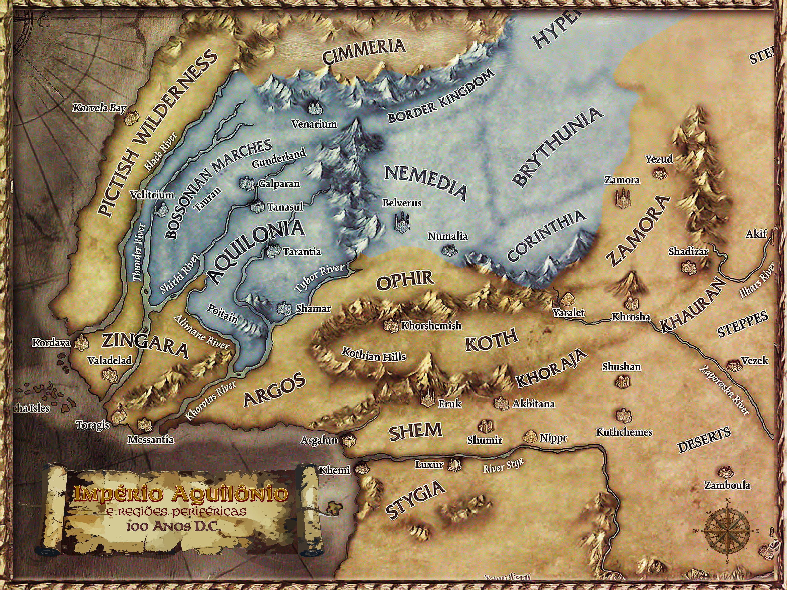

# Império da Aquilônia

O Império da Aquilônia é a tentativa de transformar conquista, linhagem, lei e guerra em uma ordem comum. Ele sobrevive porque ainda possui estradas, legiões, senadores, templos e riqueza; ele ameaça ruir porque Conn morreu sem sucessor aceito por todos.

## O centro fraturado

Aquilônia ainda é o coração do Ocidente hiboriano. Tarantia conserva o peso do trono, dos arquivos e do Senado. As legiões ainda obedecem a ordens formais. Os templos de Mitra ainda dão linguagem moral ao poder. Mas a morte de Conn abriu uma pergunta que ninguém consegue responder sem ameaçar todos os demais: quem fala pelo Império quando a Coroa está vazia?

O Império não caiu. Ele continua forte o bastante para cobrar, convocar, julgar e punir. Justamente por isso, sua crise é perigosa: cada facção tenta salvar a ordem de um modo que pode quebrá-la.

## Cinco nações

- **Aquilônia:** centro imperial, fonte da Coroa, das legiões, das estradas e da legitimidade pública.
- **Nemédia:** segundo pilar do Império e rival tradicional de Aquilônia.
- **Corinthia:** centro científico, cultural e intelectual.
- **Brythunia:** região de integração complexa, dependente das rotas e da proteção imperial.
- **Hyperborea:** o sul hyperbóreo integra o Império de modo recente e precário.

## Eixos de tensão

- **Senado e sucessão:** instituições vivas, mas nenhum centro incontestável.
- **Aquilônia e Nemédia:** as duas castas nobres sustentam o Império e disputam sua alma.
- **Fronteiras e Warbarons:** autoridade local demais pode salvar o Império ou substituí-lo.
- **Karavazyan:** mercado, rota, fortaleza e rumor em movimento.

## Próxima leitura

- [Locais do Império](Locais.md)
