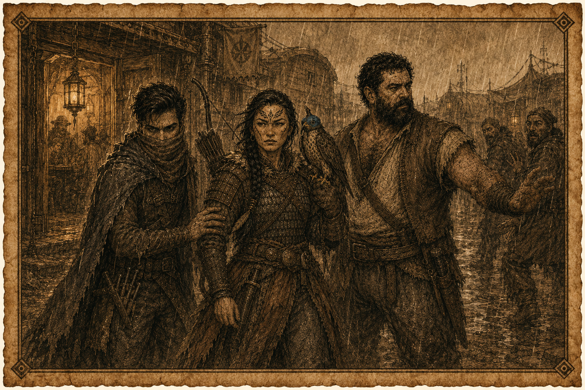

# Registro Primeiro
## A Sombra de um Sonho de Criança

*Saiba, ó príncipe, que nos anos que se seguiram à morte de Conn, filho de Conan, quando a Aquilônia
rachou como escudo velho e o selo de qualquer homem com papel na mão passou a valer mais do que a
colheita de um vale inteiro, houve cidades que não constavam em mapa algum, porque não ficavam
paradas tempo bastante para serem desenhadas.*

*Karavazyan foi a maior delas. Sete rodas de carroções em círculos, uma dentro da outra, e cada
círculo mais fundo era mais rico, mais calado e mais perigoso que o anterior. Os honestos ficavam
na borda. Os outros iam entrando.*

*Foi ali, à sombra das montanhas do Golamra, que dois forasteiros aceitaram procurar um menino que
ninguém queria achar.*

---

### Os dois da taverna

Garran do Vau viera das Marcas Bossonianas, de um vilarejo chamado Val que ficava no vão de um rio e
não interessava a ninguém até o dia em que passou a interessar. Foi ferreiro de oficina pequena,
consertou roda e pôs ferradura em animal, casou, teve dois filhos. Aprendeu cedo que um trabalhador
sozinho apanhava do patrão e que quatro juntos faziam o patrão mudar de ideia. Numa colheita ruim,
quando o cobrador veio buscar grão para uma guarnição que ninguém sabia que existia, Garran abriu o
celeiro com os companheiros para retomar o que era deles. Chegou a guarda. Ele matou três homens com
pau e faca, e teria morrido ali se um amigo não tivesse ficado para trás segurando a estrada. Garran
fugiu com o sangue ainda quente nas mãos e deixou mulher e filhos no vale. Chamava aquilo de
covardia toda vez que contava, e contava sempre que bebia.

Júnior, Filho da Areia, ninguém sabia de onde vinha, e ele gostava assim. O que se sabia era como os
dois se conheceram: Júnior tentou cortar a bolsa de moedas de Garran numa taverna qualquer,
tropeçou, e caiu em cima do homem que estava roubando. Garran se levantou furioso e passou um tempo
tentando acertar um tapa de mão aberta enquanto Júnior desviava e falava, desviava e falava, jurando
que tinha sido o tropeço, jurando que ia pagar a bebida. Garran cansou antes de acertar. Beberam
juntos. Ele sabia que fora roubado e Júnior sabia que ele sabia, e nenhum dos dois tocava no
assunto, porque Garran gostava mais de ladrão do que de cobrador de imposto e isso, para ele,
resolvia a questão.

Em Karavazyan, Garran nunca tinha passado da terceira roda. Júnior circulava mais fundo e vivia
dizendo que ele não estava pronto para a sexta.

### A mulher do falcão

Chovia na noite em que a viram. Ela discutia com três bêbados do lado de fora da taverna, e Júnior
reparou nela antes de reparar nos homens. Vestia como quem serviu: arco hyrkaniano no ombro, arma
que poucos podiam carregar e menos ainda sabiam usar, e o rosto de quem não dormia direito havia
semanas. Não era mulher que precisasse de resgate. Se quisesse, teria quebrado os três na porrada
sem perder o fôlego.

Júnior atravessou a chuva, pegou a mão dela e a puxou para dentro como se fossem velhos conhecidos.
Garran veio atrás, cruzou os braços na porta e perguntou aos homens se estavam importunando a moça.
Eles mediram o tamanho dele e decidiram que a noite podia render mais em outro lugar.

Ela se chamava Sabotei. Aceitou a cerveja e demorou a falar, e quando falou foi com a voz de quem já
repetiu aquilo para gente demais sem ser ouvida.

“Preciso encontrar meu irmão. Vocês podem me ajudar?”

O nome do menino era Ygerr. Doze anos, uma mecha de cabelo branco e uma cicatriz sob o olho esquerdo
que de longe parecia tatuagem. Sabotei estava no exército quando escravagistas passaram pela aldeia
e o levaram com outras crianças. Quando voltou para casa, a mãe tinha morrido e o irmão já tinha
sido vendido. Ela rastreou o rapaz até Karavazyan e ali o rastro morreu, porque alguém na cidade o
comprara e ninguém sabia quem.

Garran bateu a mão na mesa quando ouviu a palavra escravagista. Não houve negociação, não houve
preço. Ele bebeu a caneca inteira de um gole só e disse que iam olhar aquilo agora.

### O nome que ninguém pronunciava inteiro

Em Karavazyan a escravidão era legal, e os mercadores de escravo estavam entre os homens mais ricos
das rodas. O mercado ficava na terceira, onde a cidade deixava de ser coisa de turista.

Foi Júnior quem soube perguntar. Nas conversas certas, com as pessoas certas, um nome só apareceu:
Narzim ibn Haroud, que a rua chamava de Narzinho quando queria diminuí-lo e chamava pelo nome
inteiro quando tinha medo. Mesmo entre escravagistas ele era desprezado, porque negociava crianças,
e até quem vendia gente costumava dizer que tinha limite. Era também um dos homens mais bem
relacionados da cidade, o que na prática significava que quem encostasse a mão nele amanhecia morto
sem ter entendido por quê.

O mesmo saber trouxe um segundo nome, e esse Garran já conhecia: Ali Al'Farrad, receptador, o maior
rival de Narzim e seu companheiro de bebida, porque no submundo essas duas coisas costumavam ser a
mesma. Garran tinha carregado peso para ele. Pagava direito, dizia, mas pagava pouco. Foram procurá-
lo.

### A tenda

Al'Farrad tinha um narguilé enorme no meio da tenda e a memória boa para nomes de gente que pudesse
lhe ser útil. Recebeu os três como amigos, ofereceu assento, ouviu a história do menino e respondeu
com a frieza de quem fazia aquela conta havia anos.

“É errado vender crianças. É errado. Mas não é exatamente contra a lei, e vocês sabem disso.”

Quando o nome de Narzim caiu na conversa, ele parou. Disse que havia boatos fortes de que o homem
fosse agente zamorano infiltrado na cidade, uma espécie de embaixador, e que quem fizesse inimizade
com ele fazia inimizade com uma quantidade de assassinos que não valia a pena contar. Garran
prometeu meter a mão na cara dele assim mesmo. Al'Farrad sorriu e disse que estaria morto no dia
seguinte antes de pensar no que tinha acontecido.

Depois falou da torre. Nas montanhas do Golamra vivia havia muito tempo um feiticeiro chamado
Khar'Volun, e a torre dele era o tipo de lugar de onde ninguém voltava. Havia algumas semanas corria
pela cidade o boato de que o feiticeiro morrera. Desde então os loucos de Karavazyan tinham piorado,
as pessoas acordavam de madrugada sem saber por quê, e ninguém nas rodas andava dormindo bem.
Al'Farrad disse aquilo como quem comentava o tempo, e não foi por acaso que Júnior olhou para os
olhos vermelhos de Sabotei enquanto ele falava.

A tese do receptador era simples e conveniente: Narzim vendeu o menino para o feiticeiro, aproveitou
a viagem para reconhecer o terreno, e agora ia mandar os Chacais de Golamra, ladrões de tumba que
empregava, saquear a torre de um morto. Talvez tivesse sido ele o autor da morte. Talvez não.
Al'Farrad fez questão de dizer três vezes que era só suspeita.

O preço da ajuda dele era um mapa.

“Corre a boca pequena que um ladrão zamorano chamado Xanthes tem um caminho desenhado até a torre”,
disse Al'Farrad, e havia um brilho ambicioso nos olhos dele. O ladrão morava na quinta roda e
frequentava a Casa da Areia e da Sombra, na sexta. Al'Farrad não podia aparecer naquilo. “Tragam o
mapa e eu financio a expedição. Fico com setenta, vocês com trinta.”

Os dois acharam a proposta um absurdo e disseram isso na cara dele. Depois foram buscar o mapa assim
mesmo, que era como esse tipo de conversa costumava terminar.

### A Casa da Areia e da Sombra

Na sexta roda, a casa era guardada por homens que não eram leões de chácara e sim mercenários, e a
diferença aparecia no jeito de olhar. Júnior entrou como quem já estivera ali antes, porque já
estivera. Garran entrou atrás.

Sabotei foi com eles e resolveu na porta a única dúvida que restava sobre ela. Uma das mulheres da
casa veio ao seu encontro, e Sabotei a beijou, a empurrou de volta e disse que agora não. Depois
olhou para os dois homens e lembrou que o que ela queria era encontrar o irmão.

A madame da casa se chamava Mirena das Sete Facas, e conhecia Júnior de antes, e não com carinho.
Disse que ele tinha sido proibido de voltar sob pena de perder partes, e lembrou em voz alta o
prejuízo que ele lhe dera na última vez. Júnior tentou sair pela conversa, como sempre. A confusão
estava quase resolvida quando Mirena pegou Sabotei pelo queixo, avaliando-a como se avaliasse um
cavalo, e Garran segurou o pulso dela.

Ninguém entendeu direito o que aconteceu em seguida. Mirena soltou o braço, acertou a garganta de
Garran e o homem estava no chão antes de perceber que tinha sido atingido, lacrimejando, sem ar. Ela
lhe estendeu a mão, ajudou-o a levantar e o encarou sem dizer nada, e não precisava dizer. Apontou o
canto onde Xanthes bebia e saiu.

O plano foi rápido e quase deu certo. Garran arrumaria briga com alguém do tamanho conveniente
enquanto Júnior verificava o que o ladrão carregava. Júnior chegou perto sem ser ouvido, viu a ponta
do mapa saindo da pochete, e foi justamente ao olhar que se descuidou: Xanthes o pegou com a mão a
meio caminho.

Garran não esperou. Tomou a caneca da mão de um estranho, quebrou-a na cabeça do ladrão e o empurrou
dois passos para trás. Xanthes ficou zonzo o bastante para não sentir os dedos de Júnior tirando o
mapa da bolsa. Foi um trabalho limpo, e teria sido perfeito se Garran tivesse ido embora ali.

Ele ficou. Quis dar um último tapa e dizer ao ladrão que não queria vê-lo perto do amigo outra vez.
Bateu quatro vezes e errou as quatro. Xanthes cambaleou como bêbado, fingiu que nada tinha
acontecido, e a casa continuou tocando. Garran saiu para a chuva com a mão doendo do próprio esforço
e nenhuma marca no rosto de ninguém.

### O que estava no mapa

Do lado de fora, Júnior abriu o couro dobrado sob a luz da porta.

Era metade de um mapa. Não faltava por descuido e não tinha ficado nada para trás: o homem só tinha
aquilo. Havia trilha, havia montanha, e a trilha terminava numa dobra rasgada onde deveria estar o
resto do caminho.

Alguém em Karavazyan tinha a outra metade. Quem era, e o que custaria arrancá-la dele, os dois ainda
haveriam de descobrir.

---

> *Registro Primeiro dos feitos de Garran do Vau e de Júnior, Filho da Areia, ocorridos em
> Karavazyan à sombra do Golamra, no ano em que a coroa se quebrou.*

---

```yaml
tipo: registro-de-aventura
publico: jogadores
projeto: Conan-Legacy
registro: I
sessao_correspondente: 01
data_jogo: 2026-08-10
titulo: "A Sombra de um Sonho de Criança"
personagens: ["Garran do Vau", "Júnior, Filho da Areia"]
status: rascunho-para-aprovacao
player_safe: true
tags: [conan-legacy, registro, karavazyan, wiki]
```
